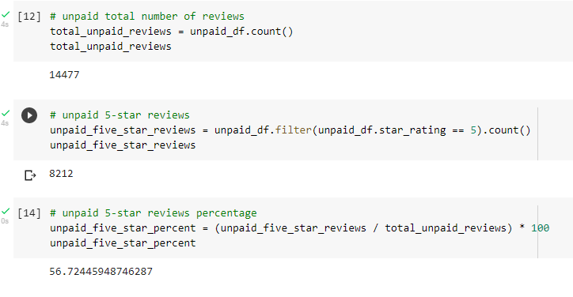

# Amazon Vine Analysis

## Project Overview

Using a dataset from the paid Amazon Vine program, analysis was completed to determine if favorable bias exists within the reviews from Vine members.

## Resources

### Data Sources 

*  https://s3.amazonaws.com/amazon-reviews-pds/tsv/index.txt
	*  https://s3.amazonaws.com/amazon-reviews-pds/tsv/amazon_reviews_us_Musical_Instruments_v1_00.tsv.gz

### Software 

* Google Colab
* PostGresSQL
* pgAdmin
* AWS

## Results

Data was extracted and converted to data frames to analyze paid (Vine) vs unpaid (non Vine).

These data frames were used to find the total number of reviews, the number of 5-star reviews,  and the percentage of five-star reviews for both paid and unpaid reviews.

## Summary

The analysis shows that the percentage of 5-star reviews for paid vs non-paid is very close. Paid reviews saw 56.66% of 5-star reviews and unpaid saw 56.72%. This shows no positivity bias for reviews done through the paid Vine program.

It should be noted, however, that the sample size of paid reviews is significantly smaller than the sample size for the unpaid reviews (paid sample size: 60,  non paid:  14,477) additional statistical analysis could be done to see if the trends for 4, 3, 2,  and 1 star are equally as comparable, but it is also likely a larger sample size for paid reviews would be required for valid results.
